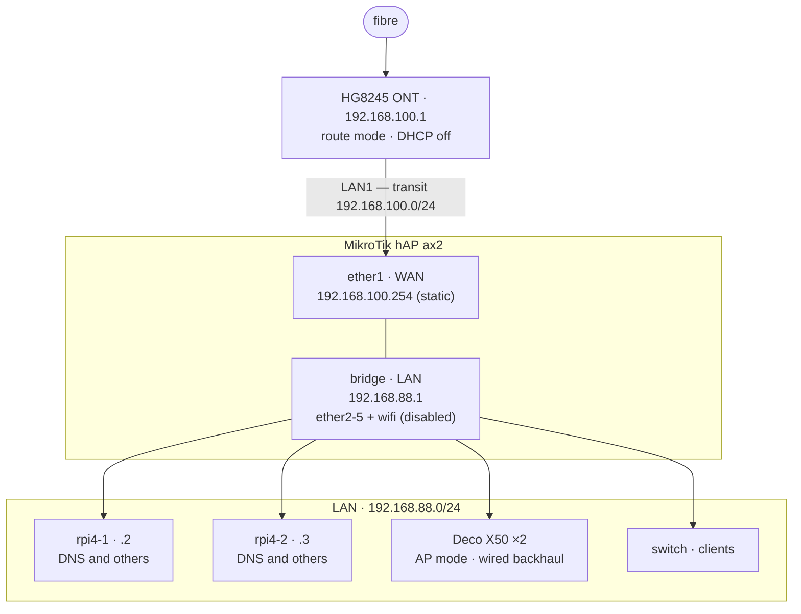

# Home network

The router config is [`ax2.rsc`](./ax2.rsc).

## Topology



| Thing                      | Value                          |
| -------------------------- | ------------------------------ |
| Transit subnet (ONT ↔ ax2) | `192.168.100.0/24`             |
| LAN subnet                 | `192.168.88.0/24`              |
| DHCP pool                  | `192.168.88.10` – `.254`       |
| Reserved for statics       | `192.168.88.4` – `.9`          |
| DNS handed to clients      | `192.168.88.2`, `192.168.88.3` |

The ONT's admin UI stays reachable from the LAN at `http://192.168.100.1`.

## Applying it

Everything here works over **SSH** (enabled by default) or **WebFig**, the built-in web
UI at `http://192.168.88.1`, which has both a Files page and a Terminal. WinBox is
optional but useful when MAC connection is required.

Starting from the default config, out of the box or after a reset-button press, the
router sits at `192.168.88.1` with DHCP on. Fill in the global `CHANGE-ME` values in
`ax2.rsc`, then:

```bash
scp ax2.rsc admin@192.168.88.1:
ssh admin@192.168.88.1
```

On the router:

```routeros
/export file=before
/system reset-configuration no-defaults=yes skip-backup=yes run-after-reset=ax2.rsc
```

The uploaded file survives the reset — that is how `run-after-reset` works. The router
wipes, reboots, applies the script, and comes back at `192.168.88.1`. Reconnect with
`ssh` and check `/log print` for the `ax2.rsc applied` line.

Pull `before.rsc` off with `scp` first if you want the old config kept locally. If `scp`
fails to negotiate SFTP, add `-O`; if the host key is rejected, add
`-o HostKeyAlgorithms=+ssh-rsa`.

Pasting the script by hand works too, but a failed line doesn't stop the ones after it —
watch for errors as they scroll past.

### If you lock yourself out

If `run-after-reset` dies partway you get a half-configured router with **no IP**, and
neither SSH nor WebFig can reach that. Two ways back:

- **Reset button** — restores the _default_ config (IP `192.168.88.1`, DHCP on), not the
  blank one. Power off, hold reset, power on, release when the LED starts flashing.
  Always works, and costs you nothing since the config lives in `ax2.rsc` anyway.
- **Layer-2 access**, to salvage rather than start over. WinBox → Neighbors tab → click
  the **MAC Address** column, not the IP column. Or from a Linux box on the same segment:
  `nix-shell -p mactelnet`, then `mactelnet -l` to discover and `mactelnet <MAC>` to
  connect — one of the pis works for this. macOS can't do it without WinBox; Docker
  there gives no raw ethernet access.

## Operating it

Wi-Fi on and off:

```
/interface wifi enable  [find]
/interface wifi disable [find]
```

If you ever run it alongside the Decos, either keep the distinct SSID or match the Decos'
SSID **and** password so clients roam between them.

Static DHCP reservations:

```
/ip dhcp-server lease
add server=lan address=192.168.88.4 mac-address=AA:BB:CC:DD:EE:FF comment="deco-1"
```

Back up after any change, and pull both files off the router:

```
/export file=ax2-config
/system backup save name=ax2-current
```

## Verification

On the router:

```
/ip address print
/ip route print
/ping 1.1.1.1 count=4
/ip dhcp-server lease print
/interface wifi print
/log print
```
